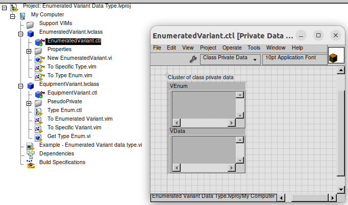
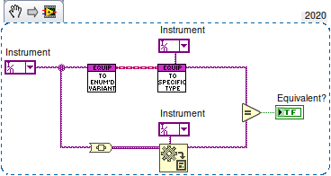
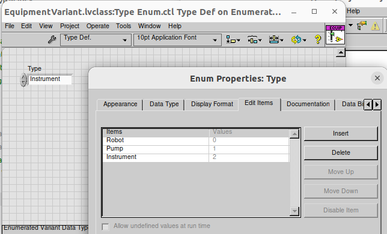
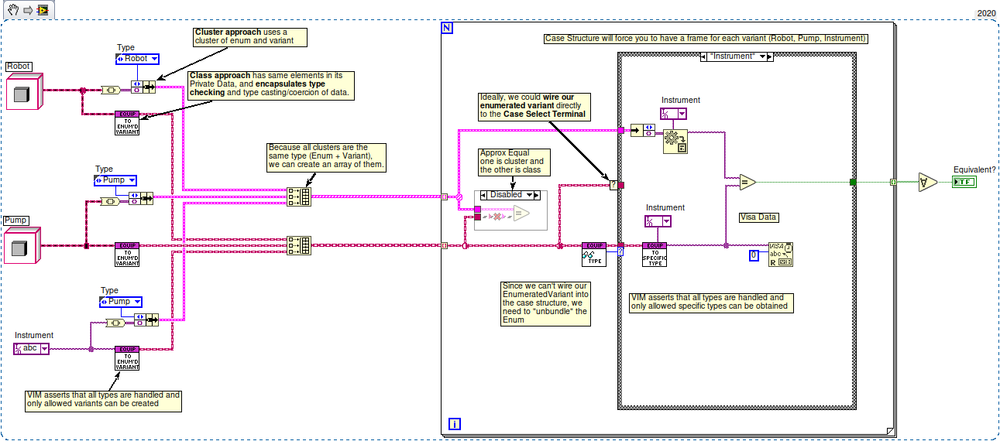
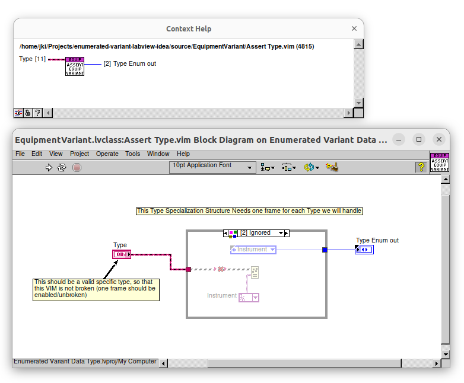
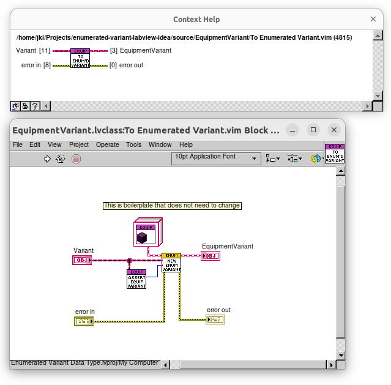
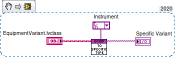
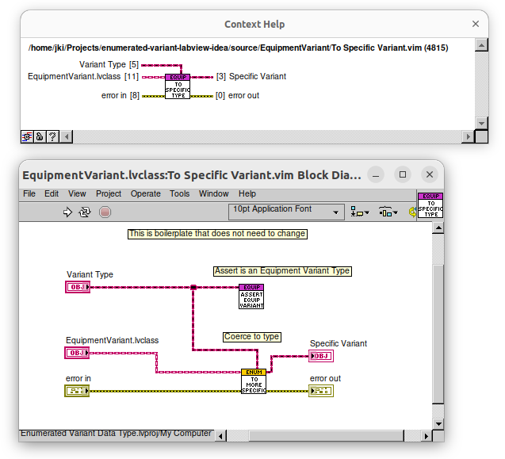
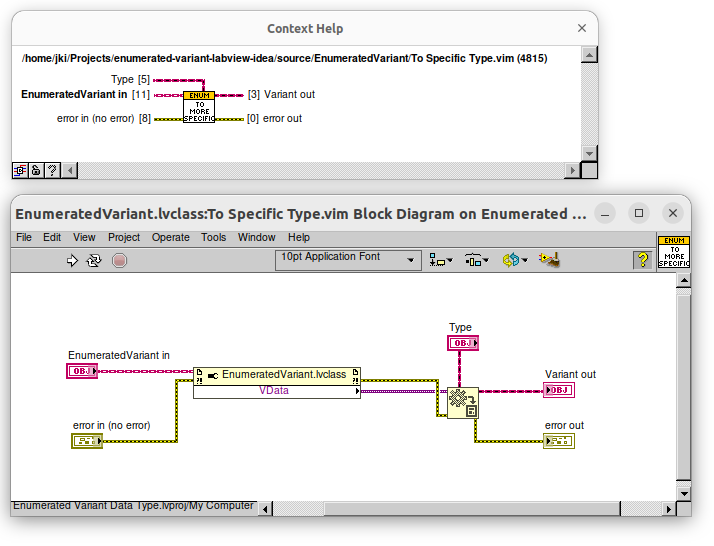
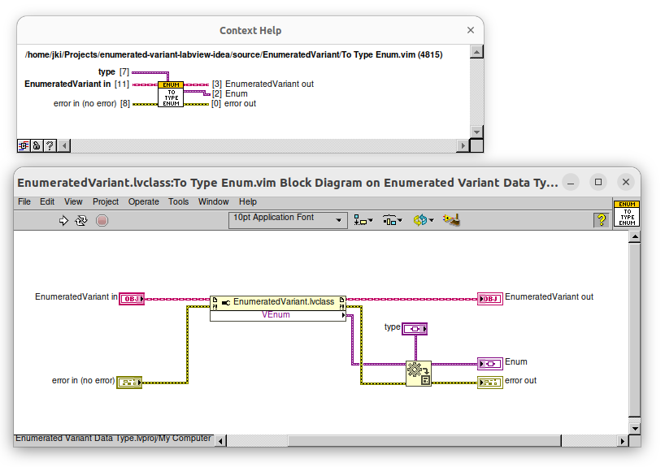

# Enumerated Variant Data Type - LabVIEW Idea

This repository contains a demonstration of a concept for a new LabVIEW feature and design pattern. All the code in this example could be used in practice, today.  Its purpose is to both show both (A) the benefits of this design pattern and (B) areas where LabVIEW could be improved at a language level to implement some of the core functionality natively.

## Motivation

Some languages like [Rust](https://www.rustlang.org ) and [Zig](https://www.ziglang.org) have a feature called Tagged Enums (or Sum Types) that allow you to create a data type that can be one of a few different types where there is a name associated with each type.  In LabVIEW, however, Enums are limited to consecutive numeric integer values -- there's no way to associate a type with each named value.

The power of combining an Enum with a set of data types for each value is that we could potentially use a Case Structure as a switch statement with type assertion and data conversion built in!  This would allow us to create a more robust and type-safe code base that is easier to maintain and understand.

## Combining LabVIEW Enums with Data Types

In LabVIEW today, we can get close to such a feature by bundling an enum and a variant into a cluster or (as this example explores more deeply) an "object" (lvclass private data).

This example has a class called `EnumeratedVariant.lvclass` which is a base class whose private data contains two Variants: one for the Type Enum and one for the specific Data.

We will also create some Malleable VIs (VIMs) for type assertion and data type conversion (for converting specific variants into our enumerated variant and back) as well as some property accessort functions.

Ideally, we would be able to avoid any boilerplate in our child classes (specific types of Enumerated Variants) and have all the type checking and data conversion handled by the base class.  However, due to limitations in LabVIEW's class and interface system in conjuction with Malleable VIs (VIMs), we will need to have some boilerplate code in our child classes.

## Example: EquipmentVariant.lvclass

Let's look at an example called `EquipmentVariant.lvclass`, which inherits from `EnumeratedVariant.lvclass`).  It has an Enum that defines the names of types that are considered `EquipmentVariants`. It also has some boilerplate code (that we alluded to), which are parts that could not be put into the base class.

### High Level Diagram

Below is an example of converting a VISA session into a specific Enumerated Variant Data Type called `EquipmentVariant`.  We see that there is also code converting directly to Variant and then back to a VISA Reference using `Variant to Data`.

As mentioned earlier, EquipmentVariant.lvclass has an Enum that defines the names of types that are considered EquipmentVariants.  This is used to enforce the types of data that can be considered EquipmentVariants: `Robot`, `Pump`, and `Instrument`.

Before we dive into the nuts and bolts, let's look at a high level example of how one might use this in an application.

## Higher-Level Example (Class vs Cluster approach)

Here is a high level example block diagram showing how we can use the `EquipmentVariant.lvclass` to handle a few different types.  Note that we also have shown, along-side a class-based approach, how one might simply use clusters to achieve the same thing (but without static type checking) -- hopefully this shows conceptually what is happening under the hood. All the extra work the class-based approach (and VIMs) is doing is to ensure that the data is of the correct type at compile time.

## Enforcing Types with VIMs and Type Assertions

Behind the scenes `EquipmentVariant.lvclass` has a Malleable VI that asserts the types of data that can be considered EquipmentVariants.  It has a frame for each type we want to include in set of EquipmentVariants. Below we can see this VI and the frame for the `Instrument` type (which is a `VISA Resource`).s

## Converting from specific types to EquipmentVariant and back

When we want to convert a `VISA Resource` data type into an `EquipmentVariant` type, we can use the `To Enumerated Variant` VIM.  This VI will check the type of the data and convert it into an EquipmentVariant.  Note that this is asserting the type is an EquipmentVariant by calling Assert Type.  If the type is not an EquipmentVariant, this VI will be broken and will not compile.

When we want to convert an `EquipmentVariant` back into a VISA Resource, we can use the `To Specific Variant` VIM.

If we look at the block diagram, we will see it is calling the Type Assertion VIM and also calling the base class's `To Specific Variant` VIM.  This is boilerplate code that we need to include in each child class, since there is no way to override a Malleable VI in LabVIEW (which, if such a feature existed, might allow the base class to call our type assertion VI at edit time and avoid the need for this boilerplate).

## EnumeratedVariant Base Class

The VIs and Malleable VIs in the base class are used to provide convenience functions for accessing the Variant Data and converting it to specific types using the `Variant to Data`.  Because they are Malleable VIs, the `Type` input will propagate down into the `Variant to Data` function and avoids the child classes needing to call these accessors and data conversion functions.

### Converting to Specific Data Type

### Converting to Specific Enum Type

