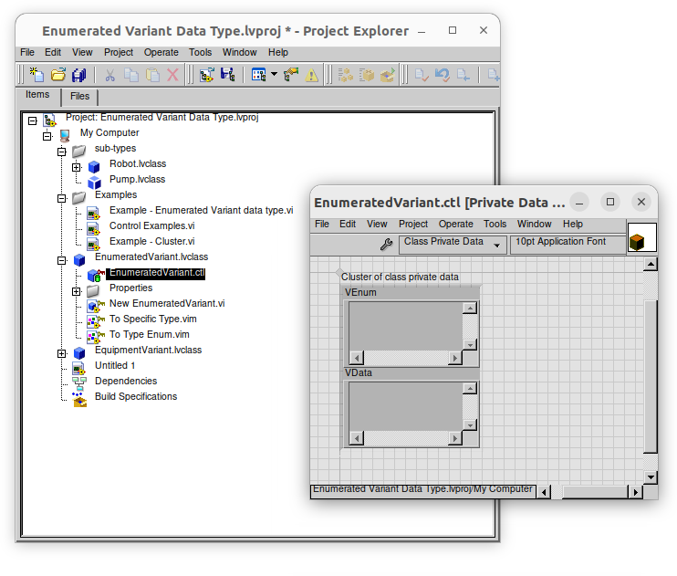

# Enumerated Variant Data Type - LabVIEW Idea

This repository contains a demonstration of a concept for a new LabVIEW feature and design pattern. All the code in this example could be used in practice, today.  Its purpose is to both show both (A) the benefits of this design pattern and (B) areas where LabVIEW could be improved at a language level to implement some of the core functionality natively.

> This is also a [LabVIEW Idea Exchange Post](https://forums.ni.com/t5/LabVIEW-Idea-Exchange/quot-Enumerated-Variant-quot-Data-Type-like-Rust-and-Zig-have/idi-p/4362485)
> 
> 
> 
> ☝️ Click to give it a star, if you think NI should implement it in a future version of LabVIEW! 

# What is an Enumerated Variant?

The idea is fairly simple, for each item in an Enum, we can associate a specific data type.  This allows us to create a new data type that can be one of a few different types where there is a name associated with each type.

> Note: This is similar to a tagged union or sum type in other languages. See [zig tagged union](https://ziglang.org/documentation/master/#Tagged-union) and [rust enums](https://doc.rust-lang.org/reference/items/enumerations.html).

## 1) Allow adding a specific datatype to each item of an Enum

## 2) Allow coercing these "variants" of our specific Enum type to and from the Enum type

## 3) Allow using these "Enumerated Variants in a Case Structure, such that conversion to the specific data type is done automatically.

## 4) Consider Organizing in an LVLib or LVClass (or maybe even create a new LVType?)
We might consider organizing Enumerated Variants in a Library, like an `.lvclass` or  `.lvlib` -- that part is up for debate. We'll see in the proof of concept example, code that an LVClass was used, and it works pretty well.

# Motivation - Why not just use classes and dynamic dispatch?

The first question you might be asking is "Why not just use classes and dynamic dispatch?"

That's a fair question.  In LabVIEW, we can use classes and dynamic dispatch to achieve similar functionality. However, Dynamic Dispatch has some some limitations/challenges.

Dynamic Dispatch Limitations:

- Requires creating a new base class for the group of types you want to consider as a single type (which isn't horrible, since it's just one class).
- Requires creating a new class for each specific type (this adds a lot of boilerplate code to maintain).
- Run-time overhead of dynamic dispatch is greater than direct calls (which can be a problem in performance-critical applications)
- Dynamic indirection of method calls (makes it harder to reason about and debug/follow the code execution paths).

Simply put, the dynamic dispatch approach requires more boilerplate code and is less efficient than a native language feature that could do the same thing. Unless your application really needs a plug-in architecture or you are creating a library for others to use, the dynamic dispatch approach is probably more work than the benefit it provides. I have an expression I like to use: "Early abstraction is obstruction."  In other words, don't abstract until you need to.

As mentioned above, the power of (1) combining an Enum with a set of data types for each value and adding native support for (2) coercion and (3) Case Structure type assertion and data conversion would allow us to create a more robust and type-safe LabVIEW code that is easier to maintain and understand (especially in situations where we do not gain much benefit from the expense of building an maintaining a plug-in architecture).

# Proof of Concept: Cluster of Enum and Variant

In LabVIEW today, we can get close to such a feature by bundling an enum and each sub-type "variant" into a cluster. Notice how even though these clusters are different types, will all coerce to a cluster of Enum and Variant. 

This allows us to do things like build arrays of these clusters and iterate over them in a For Loop.  We can then unbundle the Enum to get the type and then unbundle the Variant and convert it to the correct type of data at runtime.

This is nice, but it could be even better.  Right now ANYTHING can be put into the Variant, and we have to do a runtime check to see if the data is of the correct type.  And, one can accidentally associate the enum value with the wrong data type when an instance is created.

So, what we need is some template code that will allow us to associate a specific data type with each item in an Enum in a way that doesn't require duplicate code and can be checked at compile time rather than runtime.  Let's see how close we can get.

We'll use Malleable VIs and a LabVIEW classes to achieve this.  It won't get us all the way to native support, but it will get us to something that's easy to use and maintain.

# Proof of Concept: Malleable VIs and LabVIEW Classes

## EnumeratedVariant.lvclass (Base Class for Boilerplate Code)

In this approach, we're going to start out by creating a general-purpose base class called `EnumeratedVariant.lvclass`.  We can see its private data contains two Variants: one for the Type Enum and one for the specific Data.

> Note that we could have created a very specific class with the actual Enum for Equipment types, but we're going to keep it general for now so we can reuse this class for other types of Enumerated Variants.

`EnumeratedVariant.lvclass` has the following features:

- Property Accessor methods for the Enum and Data Variants
- A constructor for initializing the Enum and Data Variants.
- Malleable VIs for converting to the specific Type Enum and Specific Data.

These were boilerplate code, so we put them in the base class to avoid having to recreate them for each specific type of Enumerated Variant we might create in our application.

## EquipmentVariant.lvclass (our specific example)

Now, let's look at `EquipmentVariant.lvclass`.

- It inherits from `EnumeratedVariant.lvclass`)
- It has an Enum type definition that defines the names of types that are considered `EquipmentVariants`.
- It has ab `Assert Type` Malleable VI that can be used for asserting (at edit time) whether a specific data type is a valid `EquipmentVariant` subtype.

We can see that `EquipmentVariant.lvclass` does not have any private data -- it doesn't need it, because the base class will store both Enum and Data values.

We can see how these methods are used in the block diagram of this example, showing how we can create an array of different Equipment Variants and iterate over them in a For Loop, handling each type of Equipment Variant in a different frame of the Case Structure.

Unlike our feature proposal where a Case Structure's Case Select terminal/tunnels could automatically coerce to the specific data type inside of the frame for each specific type, we have to do this type conversion manually in the code.

### Error Handling and Type Safety

In our implementation with classes and malleable VIs, we will need tocheck for type errors, since we cannot guarantee the code will convert to the correct, more-specific subtype in the associated Case Structure frame for handling that type.

> Note: if the Case Structure could convert the data automatically (based on wiring the actual Enumerated Variant into the Case Selector terminal), we would have type safety (through edit time static type checking) and avoid that problem altogether. That's part of our feature proposal for native support of this new Enerated Variant type.

## Type Checking using Malleable VIs

Even though we may still have some runtime errors we need to handle, we can get some static type checking using a Malleable VI that asserts a type is one of the possible types for an `EquipmentVariant`.  We will name this VIM `Assert Type.vim` and is used in both `To Enumerated Variant.vim` and `To Specific Variant.vim`.

We can see how this VIM is called in the block diagram of `To Enumerated Variant.vim` and `To Specific Variant.vim` below:

## Assert Type.vim - Malleable VI that Maps Enum to Data Type

Looking under the hood of `EquipmentVariant.lvclass:Assert Type.vim` we see that it has a Type Specialization Structure with a frame that asserts each possible type and outputs the associated Enum value.  **This is the only location in our code that defines this association**, so it is easy to maintain and understand.

Let's say that again...

**The `Assert Type` VIM is the only location in our code that defines the association between the Enum values and its Data Type variants**.  That makes for highly maintainable code!  We simply call this VI anywhere we need to assert that a data type is a valid `EquipmentVariant` subtype.

# Conclusion

Hopefully we've shown the usefulness of an Enumerated Variant type in LabVIEW and how we can get close to this feature using Malleable VIs and LabVIEW classes.

- First, we looked at a simple feature proposal in LabVIEW that would allow us to associate a specific data type with each item in an Enum and how adding support for data coercion and integration with the Case Structure would be a huge benefit to LabVIEW developers.

- Next, we looked at how we might achieve this with a cluster of Enum and Variant.

- Then, we added some boilerplate code to a base class that would allow us to create a specific type of Enumerated Variant with minimal code duplication.

- Finally, we implemented as much static type checking as is possible today using Malleable VIs and Type Specialization Structures.

We hope this example has been helpful and that you can see the benefits of this design pattern and feature proposal.  We'd love to hear your feedback and ideas for how this could be improved or implemented in LabVIEW.

Please be sure to check out the [LabVIEW Idea Exchange Post](https://forums.ni.com/t5/LabVIEW-Idea-Exchange/quot-Enumerated-Variant-quot-Data-Type-like-Rust-and-Zig-have/idi-p/4362485) and give it a star if you think NI should implement it in a future version of LabVIEW!

☟ Click to give it a star ☟

